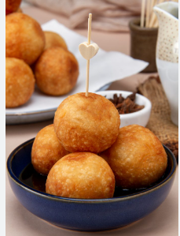

# Pagina-de-postres-tipicos-con-Html
cree una pagina web con html practicando insertar imagenes y enlaces con sus respectivas etiquetas.
<!DOCTYPE html>
<html lang="en">
<head>
    <meta charset="UTF-8">
    <meta http-equiv="X-UA-Compatible" content="IE=edge">
    <meta name="viewport" content="width=, initial-scale=1.0">
    <link rel="stylesheet" href="styles.css" >
    <title> POSTRES TIPICOS </title>
</head>
<body>
    <header>
        <h1>
            POSTRES TIPICOS DE VENEZUELA, PERU Y ARGENTINA 
        </h1>
    </header>
    <nav>
        <h3>
            DULCES TIPICOS DE VENEZUELA 
        </h3>
    </nav>
    <main>
        <section>
        <figure>
             
        </figure>
        </section>
    <ul>
        <ol>
        <il>
    <a href="https://www.divinacocina.es/mandocas/"
    target="negro">
     MANDOCA
    </a>
        </il>
        </ol>
    </ul>
       <section>
        <figure>
            
        </figure>
      </section>
    <ul>
        <ol>
        <il>
    <a href="https://www.quericavida.com/recetas/bunuelos-de-yuca-venezolanos/a39a3d60-3d5b-4480-8a32-152a99fe83b3"
    target="negro">
     BOÑUELOS DE YUCA
    </a>
        </il>
        </ol>
    </ul>
       <section>
        <figure>
            
        </figure>
      </section>
    <ul>
        <ol>
        <il>
    <a href="https://www.recetasgratis.net/receta-de-jalea-de-mango-casera-15406.html"
    target="negro">
    JALEA DE MANGO
    </a>
        </il>
        </ol>
    </ul>
       <section>
        <figure>
            
        </figure>
      </section>
</main>
 <main>
<nav>
    <h3>
        DULCES TIPICOS ARGENTINOS 
    </h3>
       <section>
        <figure>
            
        </figure>
      </section>
</nav>
      <ul>
         <ol>
         <il>
    <a href="https://www.petitchef.es/recetas/merienda/alfajores-argentinos-con-dulce-de-leche-fid-1572158"
    target="negro">
     ALFAJORES CON DULCE DE LECHE 
    </a>
         </il>
         </ol>
      </ul>
      <section>
        <figure>
            
        </figure>
      </section>
      <ul>
         <ol>
         <il>
    <a href="https://www.paulinacocina.net/receta-chocotorta-original/21722"
    target="negro">
      CHOCOTORTA
    </a>
        </il>
        </ol>
      </ul>
       <section>
        <figure>
            
        </figure>
       </section>
      <ul>
        <ol>
        <il>
    <a href="https://cookpad.com/ar/recetas/125215-postre-tipico-argentino-vigilante"
        target="negro">
      VIGILANTE
    </a>
        </il>
        </ol>
      </ul>
      <section>
        <figure>
            
        </figure>
      </section>
         </main>
         

<main>
    <nav>
        <header>
            <h3>
                DULCES TIPICOS PERUANOS 
            </h3>
        </header>
    </nav>
    <section>
        <figure>
            
        </figure>
    </section>
    <ul>
        <ol>
        <il>
    <a href="https://cookpad.com/ar/recetas/5891142-mazamorra-morada"
    target="negro">
      MAZAMORRA MORADA
    </a>
        </il>
        </ol>
    </ul>
    <section>
        <figure>
            
        </figure>
    </section>
    <ul>
        <ol>
        <il>
    <a href="https://www.clarin.com/recetas/postres/suspiro-limeno_7_lHWuRODpD.html?gclid=EAIaIQobChMInP2xr623_gIVSi1MCh359w-HEAAYASAAEgLVo_D_BwE"
    target="negro">
      SUSPIRO LIMEÑO
    </a>       
        </il>
        </ol>
    </ul>
    <section>
        <figure>
            

        </figure>
    </section>
    <ul>
        <ol>
        <il>
    <a href="https://perudelicias.com/picarones-bunuelos-peruanos/"
    target="negro">
     PICARONES
    </a>
        </il>
        </ol>
    </ul>
    <section>
        <figure>
            

        </figure>
    </section>
</main>
    </body>
</html>
